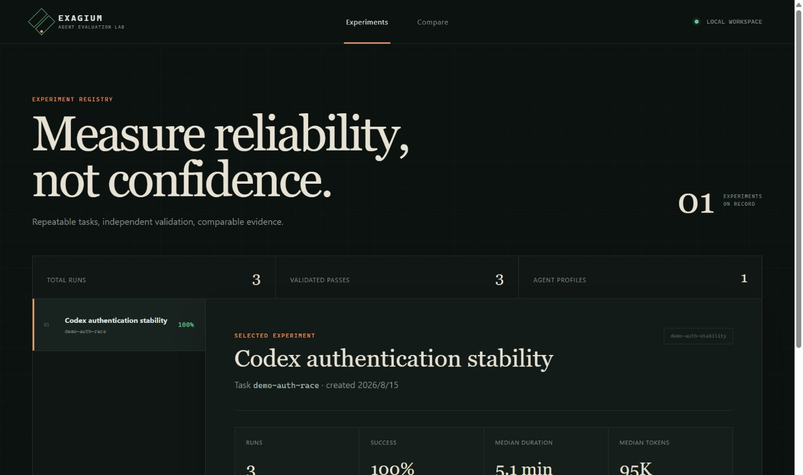
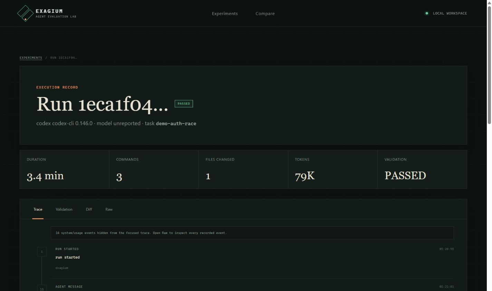
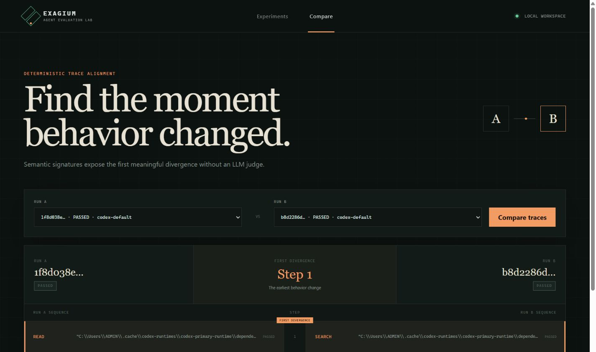

# Exagium

[](https://github.com/KaiDecker/exagium/actions/workflows/ci.yml)

**Bring your own agent. Run it, trace it, evaluate it, compare it.**

Exagium is a local-first harness for testing coding agents that are already installed and
configured on your machine. The agent does the work; Exagium prepares an isolated workspace,
records what happened, runs independent validation, and persists evidence for later analysis.

This repository currently implements the Phase 0/1 single-run milestone, Phase 2 sequential
experiments, Phase 3 deterministic run comparison, and the Phase 4 read API and Web UI:

```text
Task → Codex → Trace → Validation → PASS / FAIL / ERROR
                         ↓
                Repeat → Aggregate → Compare
```



## What works now

- `exagium doctor` checks Git, Codex, SQLite, and the workspace directory.
- YAML task manifests resolve a repository and immutable base commit.
- Every run gets its own detached Git worktree.
- `CodexCliAdapter` launches the user's existing `codex exec --json` configuration.
- Raw JSONL and a small stable normalized event model are both persisted.
- Unknown or malformed future Codex events are retained without crashing the run.
- Validation commands run after the agent exits and determine PASS/FAIL independently.
- A binary-capable Git diff, validation logs, metrics, and terminal status are stored in SQLite.
- Experiment manifests repeat one or more Codex variants sequentially and persist run membership.
- Experiment summaries report status counts, success rate, median duration, and nullable usage.
- Run comparison normalizes traces into semantic steps and reports the first divergence.
- A read-only FastAPI surface powers Experiments, Run Detail, and Compare Runs pages.
- Tests use a fake JSONL agent and require no Codex credentials or network access.

Exagium does not call an LLM API, manage provider keys, or implement its own agent loop.

## Verified real experiment

The included offline authentication race task was executed three times with the locally configured
Codex CLI on 2026-08-15. These are real runs, not seeded UI data:

| Metric | Result |
| --- | ---: |
| Runs | 3 |
| Independently validated passes | 3 |
| Success rate | 100% |
| Median duration | 5.1 min |
| Duration range | 1.3–5.3 min |
| Median reported tokens | 95,430 |
| Reported token range | 89,871–109,692 |

Three runs are a pipeline verification, not a statistically meaningful benchmark. They already
showed behavioral variance: two successful runs diverged at their first semantic step (`READ` vs
`SEARCH`) despite producing the same validated fix.

### Run evidence



### Deterministic comparison



## Requirements

- Python 3.12+
- Git
- Codex CLI, already authenticated and configured, for real runs

## Install for development

```powershell
py -3.13 -m venv .venv
.\.venv\Scripts\Activate.ps1
python -m pip install --upgrade pip
python -m pip install -e ".[dev]"
```

Run the local readiness check:

```powershell
exagium doctor
```

Install and build the Web UI once:

```powershell
cd frontend
npm install
npm run build
cd ..
```

## Define a task

```yaml
id: auth-race-001
name: Fix auth endpoint race

repo:
  path: ../auth-service
  base_ref: main

prompt: |
  Fix the intermittent HTTP 500 error in the authentication endpoint.
  Preserve public API behavior and update tests when appropriate.

setup:
  - name: install
    command: uv sync
    timeout_seconds: 120

validation:
  - name: tests
    command: uv run pytest -q
    timeout_seconds: 180
  - name: lint
    command: uv run ruff check .
    timeout_seconds: 60

limits:
  run_timeout_seconds: 900
```

Repository paths are resolved relative to the task manifest. Validation is mandatory because an
agent's final message is not ground truth.

## Run Codex

```powershell
exagium run tasks\auth-race.yaml --agent codex
```

Useful V0 options:

```powershell
exagium run task.yaml --keep-workspace
exagium run task.yaml --timeout 1200
exagium run task.yaml --json
```

Exagium deliberately inherits the user's normal Codex environment. If Codex is routed through a
local provider or router, that remains Codex's configuration; Exagium does not request the API key.

## Run the offline authentication demo

The repository includes a deliberately buggy, standard-library-only authentication fixture. Its
committed baseline fails one deterministic concurrency test (`alice` is incorrectly returned as
`bob` when two requests overlap).

Run one real Codex evaluation:

```powershell
exagium run tasks\demo-auth-race.yaml --agent codex
```

After the single-run path is healthy, repeat it three times:

```powershell
exagium experiment run experiments\demo-auth-stability.yaml
```

The independent validator always starts from the committed buggy baseline in a detached Git
worktree. It requires no package installation or network access.

## Run an experiment

```yaml
id: codex-auth-stability
name: Codex auth stability
task: ../tasks/auth-race.yaml

variants:
  - id: codex-default
    agent: codex
    label: Codex default
    repeat: 10
```

Run every repetition sequentially:

```powershell
exagium experiment run experiments\auth.yaml
exagium experiment run experiments\auth.yaml --json
```

FAILED and ERROR runs are recorded as experiment results and do not stop later repetitions.
Usage medians remain empty when an agent does not report token data.

## Compare two runs

```powershell
exagium compare <run-a> <run-b>
exagium compare <run-a> <run-b> --json
```

V0 comparison is deterministic. It maps commands and tools into stable semantic steps such as
`SEARCH`, `READ`, `EDIT`, and `TEST`, ignores harness lifecycle noise, and reports the first step
where the two sequences differ. It does not use an LLM judge.

## Open the Web UI

Build `frontend/`, then start the local read API and UI:

```powershell
exagium serve
```

Open `http://127.0.0.1:8000`. The first UI intentionally contains only:

1. Experiments and variant reliability
2. Run Detail with trace, validation, diff, and raw evidence
3. Compare Runs with first-divergence highlighting

The corresponding OpenAPI documentation is available at `http://127.0.0.1:8000/docs`.
Do not double-click `frontend/dist/index.html`; the UI requires the local API provided by
`exagium serve`.

## Inspect results

By default, runtime state lives in `.exagium/` under the current directory. Set `EXAGIUM_HOME` or
pass `--home` to choose another state directory.

```powershell
exagium runs list
exagium runs show <run-id>
exagium runs show <run-id> --events
```

The SQLite schema contains the seven intentionally small V0 tables: `agents`, `tasks`,
`experiments`, `runs`, `events`, `validation_results`, and `artifacts`.

## Quality checks

```powershell
ruff check src tests
python -m pytest
alembic upgrade head
alembic check
npm --prefix frontend run build
git diff --check
```

The integration suite creates a temporary Git repository, runs a fake Codex-compatible JSONL
process, validates its edit, checks persisted raw and normalized trace events, captures a patch,
and removes the worktree.

## Status semantics

- `PASSED`: agent process completed and every independent validator passed.
- `FAILED`: agent process completed normally, but at least one validator failed.
- `ERROR`: the harness, workspace, setup, timeout, or agent process failed.

## Roadmap boundaries

The next adapter milestone is Claude Code; advanced harness capabilities remain demand-driven.
V0 intentionally excludes a custom agent loop, multi-agent orchestration, RAG, memory, Redis,
Kafka, distributed workers, and AI root-cause analysis.

## License

MIT
